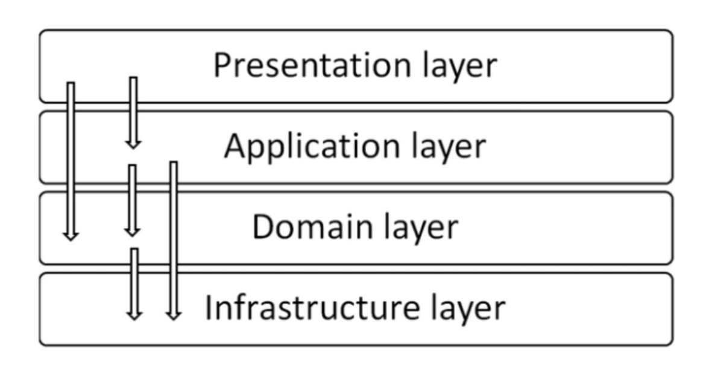
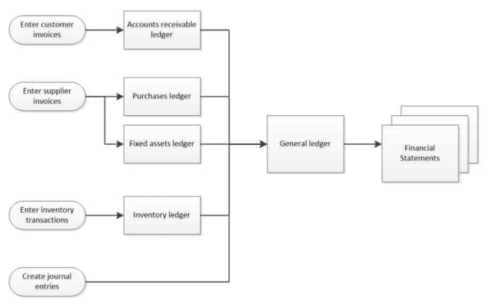
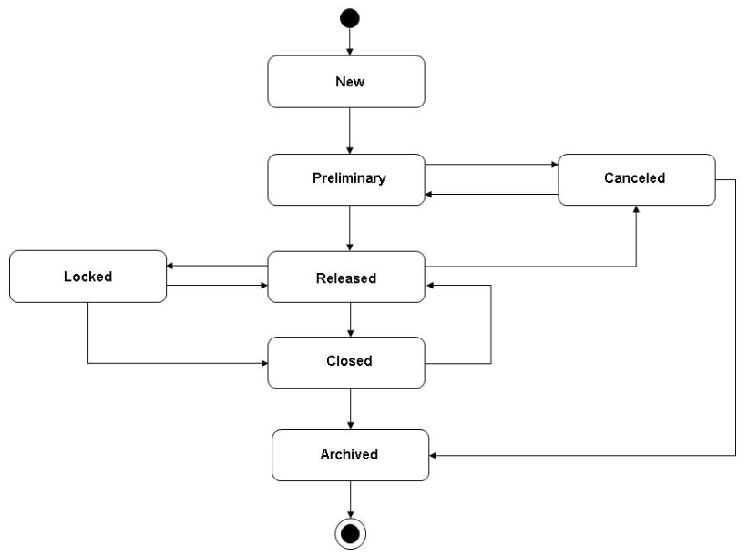
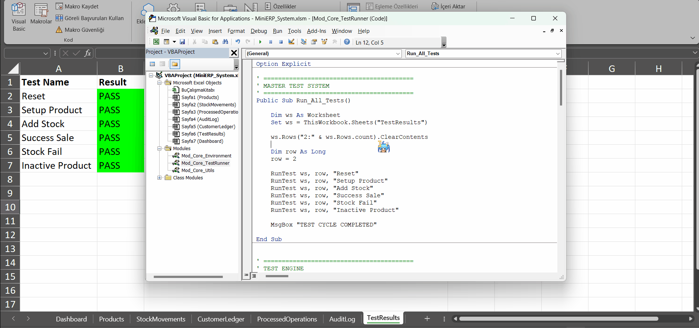
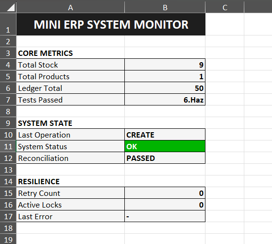
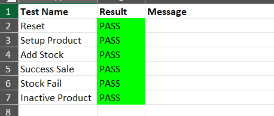
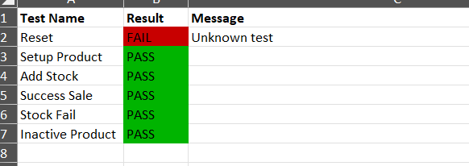

# 🚀 Mini ERP System (Excel VBA)

A **layered, failure-aware Mini ERP system** built with **Excel VBA**, designed to simulate real-world backend architecture including transaction handling, retry mechanisms, and system monitoring.

---

## 🎯 Key Features

* 🧱 **Layered Architecture**

  * Service / Policy / Repository separation
* 🔁 **Retry & Recovery System**

  * Handles partial failures and resumes safely
* ♻️ **Idempotent Operations**

  * Prevents duplicate processing
* 🔒 **Locking Mechanism**

  * Prevents concurrent conflicts with timeout handling
* 📊 **Reconciliation Engine**

  * Ensures system data consistency
* 🧪 **Automated Test Engine**

  * PASS / FAIL validation with real business errors
* 📈 **System Monitoring Dashboard**

  * Live system status and metrics

---

## 🧠 Architecture Overview



* **Service Layer** → business logic
* **Policy Layer** → validation & rules
* **Repository Layer** → data access
* **Excel Sheets** → data storage

---

## 🔄 Transaction Flow



* Document creation
* Validation
* Stock operations
* Ledger updates
* Audit logging

---

## 🔁 Document Lifecycle



* Draft → Posting → Posted
* Cancel support
* RecoveryRequired state
* Retry mechanism

---

## 🧪 Test Engine (Live Demo)



* Automated test execution
* PASS / FAIL results
* Real error handling (e.g., insufficient stock, inactive product)

---

## 📊 Dashboard



Displays:

* Total stock
* Product count
* Ledger total
* Last operation
* System status
* Test results summary

---

## 📸 Test Results

### ✔️ Successful Run



### ❌ Failure Handling



---

## 📁 Project Structure

```text
Mini-ERP-System/
│
├── docs/
│   ├── architecture/
│   │   └── architecture/Mini-ERP-Production-Architecture-Control-Report.docx
│   │   └── architecture/Mini-ERP-Production-Architecture-Control-Report.pdf
│   │
│   ├── diagrams/
│   │   ├── system_architecture.png
│   │   ├── data_flow.png
│   │   └── lifecycle.png
│   │
│   └── README.md
│
├── src/
│   │
│   ├── core/
│   │   ├── Mod_EnvironmentSetup.bas
│   │   ├── Mod_TestRunner.bas
│   │   └── Mod_Utils.bas
│   │
│   ├── entities/
│   │   ├── Ent_Product.cls
│   │   ├── Ent_Document.cls
│   │   ├── Ent_DocumentLine.cls
│   │   ├── Ent_Ledger.cls
│   │   ├── Ent_StockMovement.cls
│   │   └── Ent_Transaction.cls
│   │
│   ├── services/
│   │   ├── Svc_Product.cls
│   │   ├── Svc_Document.cls
│   │   ├── Svc_Stock.cls
│   │   ├── Svc_Transaction.cls
│   │   ├── Svc_Reconciliation.cls
│   │   └── Svc_Governance.cls
│   │
│   ├── policies/
│   │   └── Pol_Document.cls
│   │
│   ├── repositories/
│   │   ├── Repo_Product.cls
│   │   ├── Repo_Ledger.cls
│   │   ├── Repo_Audit.cls
│   │   ├── Repo_ProcessedOperations.cls
│   │   └── Repo_StockMovement.cls
│   │
│   └── queries/
│       ├── Qry_Product.cls
│       ├── Qry_Stock.cls
│       ├── Qry_Reconciliation.cls
│       └── Qry_Dashboard.cls
│
├── assets/
│   ├── screenshots/
│   │   ├── dashboard_overview.png
│   │   ├── test_results_all_pass.png
│   │   └── test_results_failure_case.png
│   │
│   └── demo/
│       └── test_engine_run.gif 
│
├── MiniERP_System.xlsm   
│
├── README.md
└── .gitignore
```

---

## ⚙️ Tech Stack

* **Excel VBA**
* Layered Architecture Design
* Manual Data Storage (Excel Sheets)
* Custom Test & Monitoring System

---

## 📌 Notes

* This project focuses on **system design and reliability**, not UI
* VBA code is exported as `.bas` and `.cls` files for version control
* Designed to demonstrate **engineering thinking beyond CRUD applications**

---

## 🎯 Why This Project?

This project demonstrates:

* Real-world system behavior simulation
* Error handling & recovery design
* Clean architecture principles in a constrained environment (Excel VBA)

---

## 👤 Author

Developed as a portfolio project to showcase backend/system design skills using Excel VBA.

---
